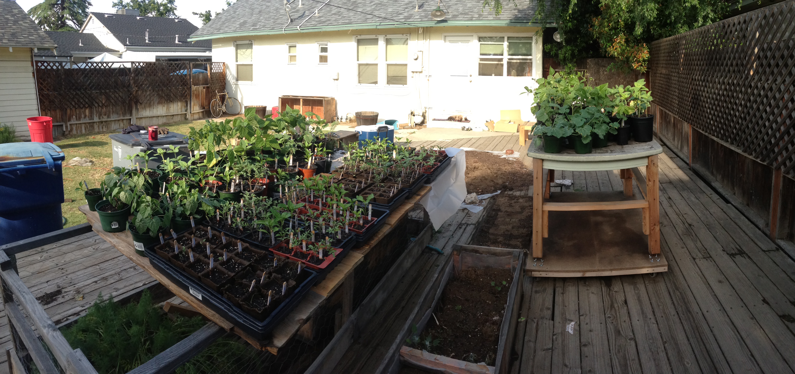

# sandbox

This is a little repo that I created for storing the results of small coding challenges, like finding the longest palindrome in a string of random characters, sorting arrays in various ways and some other basic stuff.

I recently decided to take some time off from work to refocus myself and will be entering the job market again soon. I thought I’d brush up on some fundamentals and these coding challenges were fun little exercises to work though. Everything is written for NodeJS.

Here's my [current resume](https://www.dropbox.com/s/hipd37bgykru78j/Shawn_Wilson-Resume.pdf?dl=0). If you want to see some actual working code for a front-end app that I wrote, go check out [MCC-UI](https://github.com/goneplaid/mcc-ui).

Have a wonderful day!
