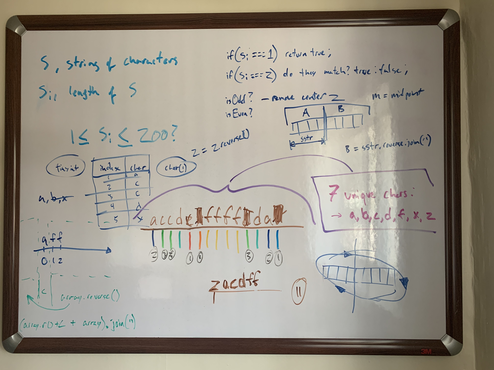

# sandbox / misc-exercises

These are some pretty simple exercises involving basic operations; a mix of problems that I've seen cited in
posts about job interview questions alongside problems from Gayle Laakmann's "Cracking The Coding Interview".

Here are some white boards that I drew up for a few of these.

## Fibonacci Sequence

## Longest Palindrome, #1

## Longest Palindrome, #2

