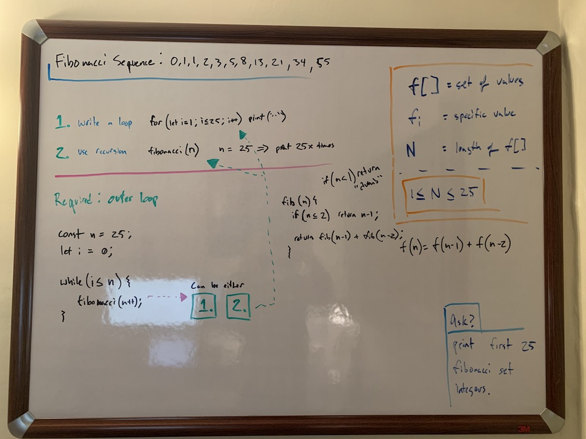
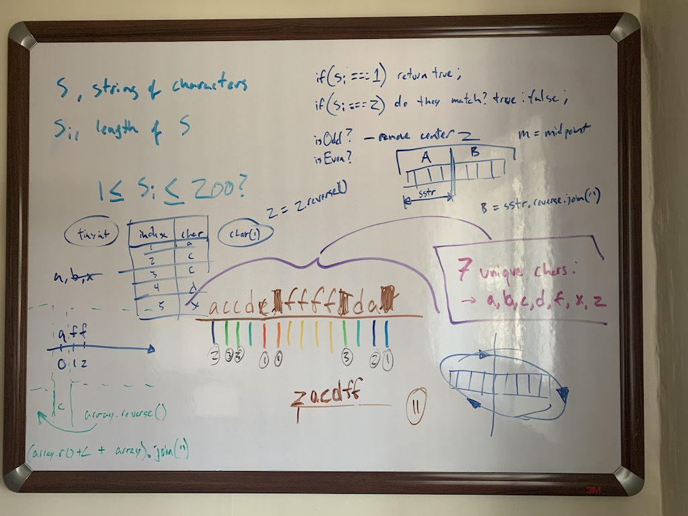
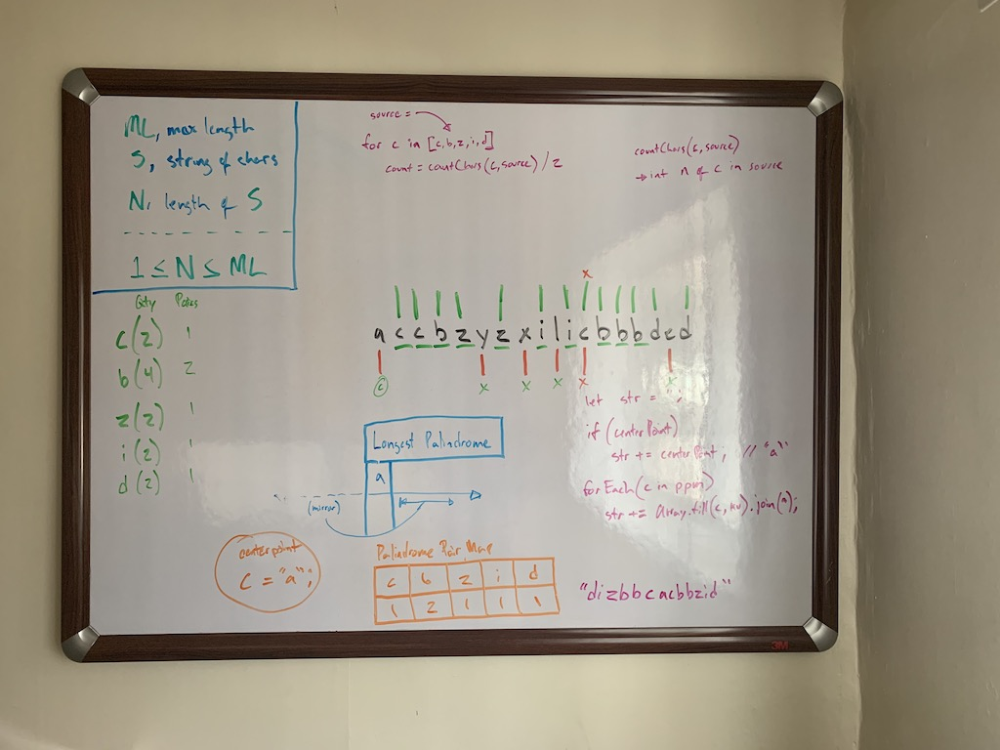
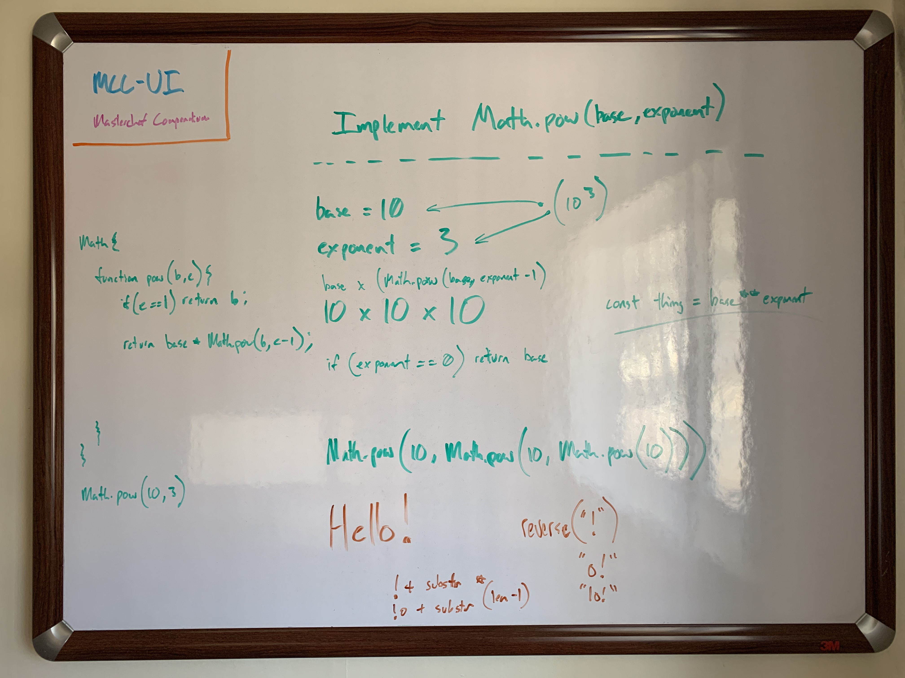

# sandbox / misc-exercises

These are some pretty simple exercises involving basic operations; a mix of problems that I've seen cited in
posts about job interview questions here and there.

Here are few white boards that I drew up for some of these.

## Fibonacci Sequence

## Longest Palindrome, #1

## Longest Palindrome, #2

## Math.pow()

